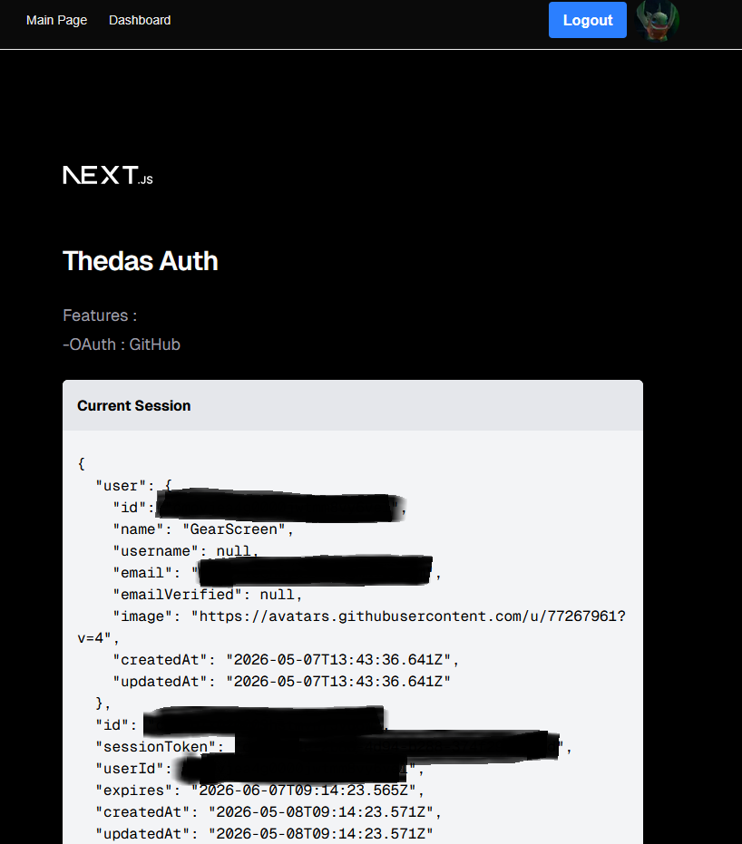

# ThedasAuth User System

-A simpler version of the my [Thedas user system](https://github.com/GearScreen/UserSystem) 
-Only use OAuth to register users (doesn't have a custom registering) 

## Features

-Signin using Google or Github 
-User Sessions 
-Store users + custom data in MariaDB 

## How to test

Download Repo or git clone 
Create GitHub OAuth app 
Set .env 
docker compose up 

## Progress

